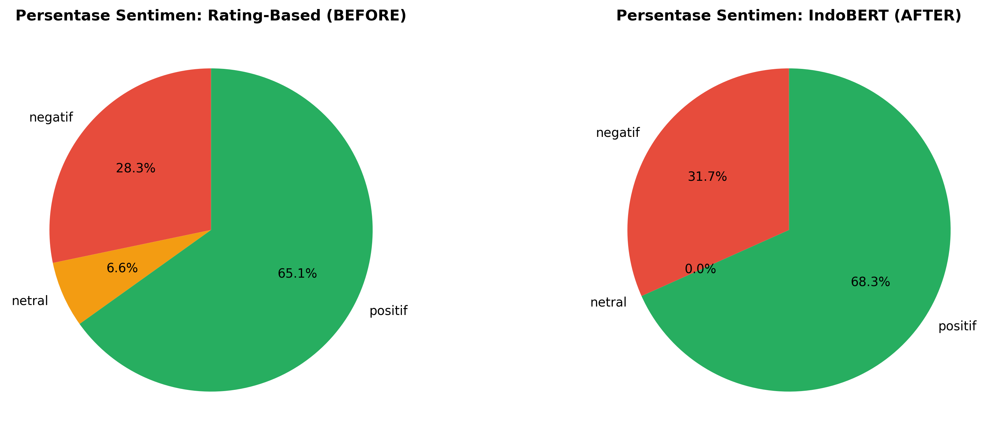

# 📊 Laporan Analisis Sentimen Roblox

**Dibuat:** 2026-05-13 23:01:30

---

## 📈 Ringkasan Eksekutif

| Metrik | Nilai |
|--------|-------|
| Total Review | 49,485 |
| Agreement | 41,696 (84.26%) |
| Disagreement | 7,789 (15.74%) |

**Kesimpulan:** Dari 49,485 review yang dianalisis, terdapat **84.3%** kesesuaian antara sentimen berbasis rating dan prediksi IndoBERT. Tingkat disagreement **15.7%** menunjukkan ada perbedaan penting dalam interpretasi teks dibanding rating numerik.

---

## 📊 Distribusi Sentimen

### Rating-Based (Sebelum)
- ✅ **Positif:** 32,225 (65.12%)
- ❌ **Negatif:** 13,990 (28.27%)
- ⚪ **Netral:** 3,270 (6.61%)

### IndoBERT-Based (Sesudah)
- ✅ **Positif:** 33,795 (68.29%)
- ❌ **Negatif:** 15,690 (31.71%)
- ⚪ **Netral:** 0 (0.00%) *IndoBERT hanya menghasilkan binary classification*

---

## 🔄 Cross-Tabulation Analysis

| Rating Asli | Prediksi Negatif | Prediksi Positif | Total |
|-------------|------------------|------------------|-------|
| Negatif     | 11,825           | 2,165            | 13,990 |
| Netral      | 1,511            | 1,759            | 3,270  |
| Positif     | 2,354            | 29,871           | 32,225 |
| **Total**   | **15,690**       | **33,795**       | **49,485** |

---

## ⚠️ Analisis Ketidaksesuaian

Total ketidaksesuaian: **7,789** (15.74%)

| Kategori Ketidaksesuaian | Jumlah | Persentase |
|--------------------------|--------|-----------|
| Positif → Negatif        | 2,354  | 4.75%     |
| Negatif → Positif        | 2,165  | 4.37%     |
| Netral → Positif         | 1,759  | 3.55%     |
| Netral → Negatif         | 1,511  | 3.05%     |

### Interpretasi Ketidaksesuaian

- **Positif → Negatif (2,354):** User memberikan rating tinggi namun teks mengandung keluhan spesifik yang terdeteksi oleh model sebagai negatif.
- **Negatif → Positif (2,165):** User memberikan rating rendah tetapi teks lebih netral/positif, mungkin karena kesalahpahaman atau format konten.
- **Netral → Positif (1,759):** Rating 3 diinterpretasikan model sebagai positif berdasarkan konten teks.
- **Netral → Negatif (1,511):** Rating 3 diinterpretasikan model sebagai negatif berdasarkan konten teks.

---

## 📸 Visualisasi

### 1. Perbandingan Distribusi

### 2. Confusion Matrix

### 3. Persentase Distribusi

### 4. Analisis Agreement

---

## 💡 Insights & Rekomendasi

1. **Model Performance:** Tingkat agreement 84.26% menunjukkan model IndoBERT cukup baik dalam memprediksi sentimen.

2. **Case Misalignment:**
   - Positif rating dengan review negatif: Kemungkinan user memberikan rating bintang banyak tapi menulis keluhan detil.
   - Rating netral dengan prediksi ekstrem: Model lebih sensitif terhadap keyword daripada rating numerik.

3. **Actionable Insights:**
   - Gunakan combined approach (rating + text) untuk analisis lebih akurat.
   - Untuk high-value reviews (disagreement cases), perlu manual review.
   - Model cocok untuk automated sentiment tagging pada volume besar.

---

## 💾 File Output

### CSV Files
- `sentiment_comparison_full.csv` - Dataset lengkap dengan semua kolom
- `sentiment_comparison_summary.csv` - Ringkasan statistik
- `sentiment_crosstab.csv` - Cross-tabulation
- `sentiment_disagreement_examples.csv` - Contoh-contoh ketidaksesuaian

### Visualizations
- `01_distribution_comparison.png`
- `02_confusion_matrix.png`
- `03_percentage_distribution.png`
- `04_agreement_analysis.png`

---

## 📋 Model Information

- **Model:** `indobenchmark/indobert-base-p1`
- **Task:** Sentiment Classification (Binary)
- **Training Data:** Roblox reviews (processed & cleaned)
- **Test Accuracy:** 85.49%
- **Location:** `models/indobert_sentiment/best_model/`

---

**Report Generated:** 2026-05-13 23:01:30
**Project:** Skripsi Roblox Sentiment Analysis
